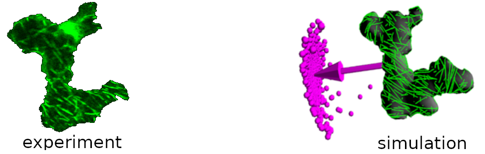

.. CorticalSim 3D documentation master file, created by
   sphinx-quickstart on Tue Mar 17 14:38:49 2026.
   You can adapt this file completely to your liking, but it should at least
   contain the root `toctree` directive.

CorticalSim 3D documentation
============================

.. toctree::
   :maxdepth: 1
   :caption: Contents:

   introduction
   quickstart
   development
   technical

